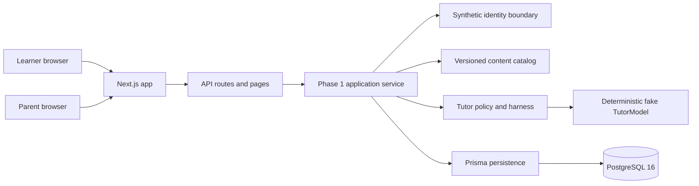
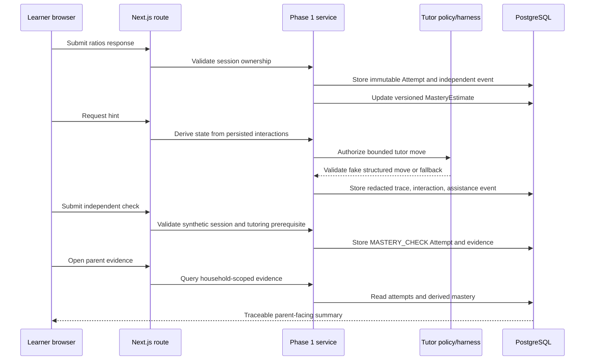

# System Architecture

## Architectural choice

Use a modular monolith for the MVP: one deployable web application with explicit domain modules and background jobs. This keeps iteration, transactions, local development, and testing straightforward while retaining seams for later extraction.

## Current implementation baseline (2026-09-05)

The repository currently implements the first synthetic Phase 1 slice within
this architecture. The deployable unit is a Next.js application; server routes
call application services, which use Prisma for PostgreSQL persistence. The
only identity is a fixed, server-owned synthetic household for local and CI
verification. The tutor uses the deterministic fake adapter, not a real model
provider. Authentication, consent capture, provider selection, and production
deployment remain pending decisions.

## Technology stack and rationale

Each choice is tied to a specific application responsibility. The MVP favors a
small TypeScript team surface, explicit module boundaries, deterministic tests,
and a straightforward path from local development to managed hosting.

| Technology or boundary | Application components using it | Why it was chosen | Status and limits |
|---|---|---|---|
| **Next.js 15** | Learner and parent pages; `/api/phase1/*` route handlers; one deployable web process | Combines the web UI and server routes in one modular monolith, reducing deployment and local-development overhead while retaining clear server boundaries for authorization and policy decisions | Implemented. It is the web shell, not the domain model or tutor policy itself |
| **TypeScript 5.9** | Application services, tutor policy, contracts, route handlers, content catalog, test helpers, and configuration | Gives shared compile-time types across browser/server boundaries and makes ports such as `TutorModel` explicit; this reduces accidental coupling between model output, policy, and persistence | Implemented. Runtime validation is still required for external/model data |
| **React 19** | Learner answer form, tutor interaction panel, parent evidence view, loading/error/status states | Supports small interactive flows with accessible semantic controls and keeps the current UI surface easy to test; no separate client framework is needed for this MVP | Implemented. A larger component library is deferred until accessibility and design needs justify it |
| **PostgreSQL 16** | Households, synthetic identities, sessions, immutable attempts, assistance events, tutor traces/interactions, mastery estimates, and evidence contributions | Relational constraints, transactions, indexes, and durable history fit traceable learning evidence better than an unstructured store; it is also widely available as a managed production service | Implemented locally and in CI. Production region, backups, retention, and deletion policy remain pending |
| **Prisma 6** | Database client in `src/server/prisma.ts`; schema, migrations, seed, and persistence integration tests | Provides typed access to the relational model and reviewed migrations without hiding the underlying SQL relationship structure; the repository also keeps an explicit rollback script because Prisma has no first-class down migration | Implemented. It is a persistence adapter, not an authorization or retention engine |
| **Zod 4** | Content catalog parsing; tutor move output; attempt/mastery/trace/provider contracts; route request validation | Converts untrusted JSON and model responses into checked runtime data, supporting the hard requirement to reject or repair malformed structured output | Implemented at content, API, and tutor boundaries. It does not replace domain or policy tests |
| **Provider-neutral `TutorModel` port** | `TutorHarness`, fake tutor, future real-provider adapter, structured move and constructed-response boundaries | Prevents provider SDK types and behavior from leaking into policy, content, student-model, or reporting modules; enables synthetic testing before provider approval | Port and fake adapter implemented. Real provider, child-data terms, region, and credentials are pending |
| **Deterministic tutor policy** | State transitions, permitted assistance, answer protection, fallback, server-derived hint context, and mastery non-advancement on fallback | Authorization must be deterministic and auditable because an LLM must not choose permissions, reveal answers, access data, or establish mastery | Implemented for Math Tutor/fake sessions. Human policy approval and real-model evaluation remain required |
| **Fixed synthetic identity boundary** | Local learner session, parent evidence scope, household ownership checks, and synthetic seed data | Allows end-to-end development without authentication credentials or real child data while preserving the ownership checks that production identity must satisfy | Implemented for local/CI only. It is not authentication, guardian verification, consent capture, or pilot identity |
| **Vitest 3** | Contract, content, tutor-policy, evaluation, persistence, and Phase 1 integration tests | Fast deterministic feedback for domain rules and database-backed services; supports the required unit, contract, integration, and synthetic-eval layers | Implemented. Real-provider quality is intentionally not represented by fake tests |
| **Playwright** | Browser journeys for learner submission, multi-step hints, independent check, and parent evidence | Verifies the primary user journeys through the actual Next.js surface, including accessible labels and server integration, rather than testing only implementation details | Implemented. The current journeys use synthetic identity and local PostgreSQL |
| **Privacy-filtered trace records** | Tutor trace metadata, redacted excerpts, validation outcome, policy/prompt/model versions, and token/latency fields | Preserves enough evidence to audit tutor behavior while avoiding raw child text and secrets by default; this supports safety review and future model comparison | Partial implementation. Production observability sinks, access controls, retention, and incident operations remain pending |
| **Database-backed job seam** | Reserved for future review scheduling, planner work, exports/deletions, and asynchronous evaluation | Keeps future asynchronous work possible without introducing a queue service before workload or reliability evidence requires one | Deferred. No queue infrastructure is part of the current MVP slice |
| **Provider-neutral `NotifierPort`** | `buildWeeklyDigest`, `ConsoleNotifier`, future real email/push adapter | Mirrors the `TutorModel` port pattern so a parent-communication provider can be chosen later without coupling digest content to a specific vendor | Port, deterministic digest builder, and console/fake adapter implemented. No scheduler calls it yet — that is the database-backed job seam above — and no real provider, address, or delivery exists |
| **Versioned skill catalog and planner** | `skillCatalog` (`content/skills/*.json`), `planNextActivities`, `getPlan`, `GET /api/phase1/plan` | Applies the LF-0.5 content-as-versioned-JSON precedent to the skill graph (ADR-0006) rather than adding new Postgres tables; the planner is a pure function so it is testable without a database or scheduler | Skill catalog (19 skills, cycle/prerequisite-integrity checked), the deterministic planner, a Phase 1 route, and a read-only "Recommended next activities" learner-page section are implemented. The plan is informational only — selecting a planned item does not yet start a session for it, since Phase 1 sessions remain hardcoded to one content item. No scheduler exists, and no `ReviewSchedule`/spaced-review timing exists |
| **Managed Node/PostgreSQL deployment** | Future web runtime and managed database for an invite-only pilot | Preserves the local architecture while delegating routine runtime/database operations to a managed platform; vendor choice should follow privacy, region, cost, backup, and operational review | Not selected. No deployment or production data path exists. ADR-0005 records a non-binding recommendation (a long-running-process platform such as Render or Fly.io over serverless) as input to that review |

## Runtime architecture



The intended production substitution points are the identity boundary and the
`TutorModel` adapter. They must not change the policy, content, student-model,
or reporting contracts.

## Learner evidence flow



The model may phrase an authorized pedagogical move, but it cannot choose the
state, reveal protected answers, access another household, or establish
mastery. The current independent check is a synthetic workflow demonstration;
it is not yet calibrated elapsed-time delayed-performance evidence.

## Modules

| Module | Responsibility |
|---|---|
| Identity | Parent/learner relationships, consent, roles |
| Curriculum | Standards, skills, prerequisites, versions |
| Content | Lessons, problems, solutions, rubrics, provenance |
| Assessment | Attempts, deterministic scoring, rubric scoring |
| Student Model | Mastery, misconceptions, uncertainty, review due dates |
| Planner | Selects next learning activities under time/goal constraints |
| Tutor | Policy state machine, context assembly, model adapter, response validation |
| Reporting | Evidence-linked learner and parent views |
| Evaluation | Offline cases, regression runs, release gates |
| Audit | Model/policy/content versions and privacy-filtered traces |

## Tutor request flow

1. Accept learner message and problem/attempt context.
2. Load only relevant skills, misconception hypotheses, and tutor policy.
3. Determine allowed intervention level with deterministic code.
4. Ask model for a structured tutor move—not arbitrary free-form control.
5. Validate schema, mathematical correctness where possible, leakage, tone, and policy compliance.
6. Repair once or fall back to a curated response.
7. Persist the move, assistance level, versions, and trace metadata.

The model may phrase a pedagogical move; it does not decide authorization, mastery transitions, or data access.

## Provider interface

The application should own a narrow interface such as:

```ts
interface TutorModel {
  generateMove(input: TutorMoveInput): Promise<TutorMoveOutput>;
  scoreConstructedResponse(input: ScoringInput): Promise<ScoringOutput>;
}
```

Use schemas and provider adapters. Avoid provider-specific objects outside the adapter.

## Content format

Store authored seed content in version-controlled JSON/YAML validated at import. Production records include provenance, license status, reviewer, version, difficulty, skill mapping, solution method, common wrong answers, and approved hint ladder. Provenance tracks `original`, `licensed`, and `llm_drafted` content distinctly (`docs/content-authoring-pipeline.md`); every origin is subject to the same human review gate before acceptance. Math notation and diagrams, once a domain needs them, follow the KaTeX/reviewed-SVG approach recorded in `docs/adr/0004-math-and-diagram-rendering.md`.

## Deployment stages

- Local: seeded PostgreSQL, fake model adapter
- Preview: managed database, sandbox model credentials, synthetic learner data
- Production pilot: invite-only, one family, encrypted backups, monitoring and rollback

## Architecture decision records

Create `docs/adr/NNNN-title.md` for consequential choices. Each ADR records context, decision, alternatives, consequences, and reversal signals.
